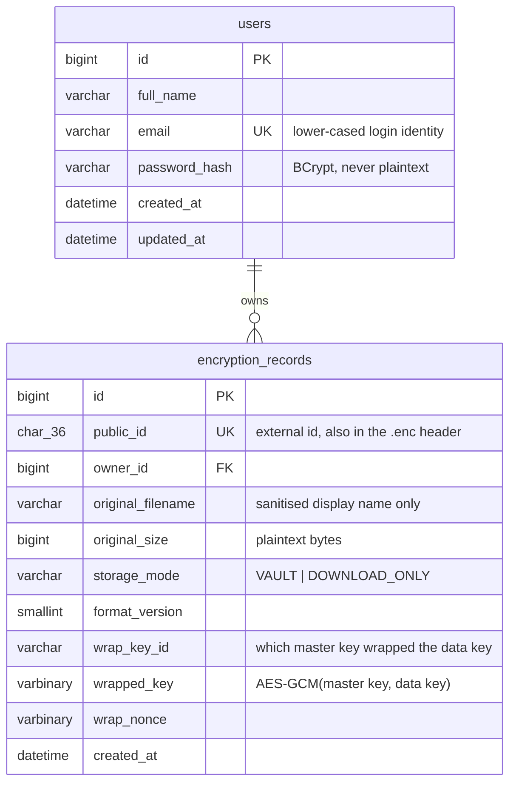

# SecureVaultX — Architecture & Security Design

This document explains the *why* behind the major decisions in SecureVaultX.
For setup/run instructions see the root [README.md](../README.md).

## 1. High-level architecture

```text
Flutter (Android / Windows / desktop / mobile)
                    │
                    │  HTTPS · REST · JSON  (session cookie + CSRF token)
                    ▼
             Spring Boot backend
                    │
       ┌────────────┼─────────────┐
       │            │             │
  Controller     Service       Security
       │            │             │
       └────────────┼─────────────┘
                     │
               Repository (Spring Data JPA)
                     │
                  MySQL              Local filesystem
              (metadata only)      (encrypted bytes only)
```

**Flutter never talks to MySQL, and never talks to the filesystem of the
server.** Every operation goes through the REST API, where Spring Security
identifies the caller and every service method re-derives the owner from
that identity — never from a client-supplied field. This is what makes
"user A cannot read user B's file" a property of the architecture rather
than something every endpoint has to remember to check.

## 2. Why session auth, not JWT

The spec for this version explicitly rules out JWT. Reasoning, for the
record:

- A Flutter *native* client (Android/Windows/desktop) can persist an
  HttpOnly session cookie exactly the way a browser does, using a cookie
  jar in the HTTP client (`dio_cookie_manager` + `cookie_jar`, persisted to
  disk). There is no practical advantage to a bearer token here.
- Sessions let Spring Security own the entire authentication lifecycle
  (login, logout, concurrent-session handling, timeout) instead of custom
  token issuance/verification/revocation code.
- JWTs add real complexity (signing keys, refresh-token rotation, revocation
  on logout) that buys nothing for a single-backend, non-federated app.

**Adding JWT later** would only mean: add a second `SecurityFilterChain`
matched to `/api/**` with `Authorization: Bearer` header parsing, backed by
the *same* `AppUserDetailsService` and the *same* service layer. Nothing in
`VaultService`, `TransferService` or `EnvelopeCryptoService` would change,
because they already take the owner id from `Authentication`, not from a
concrete authentication mechanism.

## 3. Why CSRF stays enabled

The old assumption "disable CSRF, it's a REST API" is wrong here: this API
authenticates with a *cookie*, and cookies are sent automatically by HTTP
clients including browsers. A REST API is only safe to blanket-exempt from
CSRF when it authenticates with a header the browser won't attach for you
(a bearer token). Since we use cookies, CSRF stays on:

1. Client calls `GET /api/auth/csrf` → gets `{ headerName, token }`.
2. Client sends that token back in the `X-CSRF-TOKEN` header on every
   state-changing request (`POST`/`DELETE`).
3. A `403 CSRF_INVALID` response tells the client to re-fetch the token
   (session/token rotated) and retry once — the Flutter `ApiClient` does
   this automatically.

## 4. Encryption design

### 4.1 Envelope encryption

```text
File                                  Per-file AES-256 key
  │                                          │
  ▼                                          ▼
Random 256-bit data key            AES-256-GCM(master key, data key)
  │                                          │
  ▼                                          ▼
AES-256-GCM(data key, file)         Wrapped key (ciphertext + nonce)
  │                                          │
  ▼                                          ▼
Encrypted file (.enc)              Stored as metadata in MySQL
```

Every file gets its **own** random data key — a compromise of one file's
key material never affects any other file. The data key itself is never
stored in the clear: it is wrapped (AES-256-GCM) under a master key that
lives only in an environment variable (`SECUREVAULTX_MASTER_KEY`), never in
source control, never in the database.

Key-wrap nonces are independent, freshly random 96-bit values, generated
by a *different* `SecureRandom` call than the per-file chunk nonces — the
spec is explicit that wrapping and file encryption are separate
cryptographic operations and must never share nonce material.

### 4.2 Streaming chunked AES-GCM (the `.enc` format)

Whole-file AES-GCM would require buffering the entire file (for encryption)
or fully receiving+authenticating it before writing any output (for
decryption) — both violate the "constant memory, streaming" requirement for
arbitrarily large files. SecureVaultX instead uses the same chunked
"STREAM" construction used by libraries such as Tink and age:

```text
offset  size  field                                  (33-byte header, AAD for every chunk)
  0      4    magic "SVXF"
  4      1    format version (currently 1)
  5      1    reserved (0x00)
  6      4    chunk size (plaintext bytes per chunk)
 10     16    record UUID
 26      7    random per-file nonce prefix
 ---
 header + [chunk₀][chunk₁]...[chunkₙ]     each chunk = AES-256-GCM(16-byte tag included)
```

- **Nonce** for chunk *i* = `noncePrefix (7B) ‖ chunkIndex (4B) ‖ isLastChunk (1B)`.
  The prefix is random per file; the counter makes every nonce unique
  *within* a file; the random prefix makes reuse across files harmless.
- **AAD** for chunk *i* = `header bytes ‖ chunkIndex (8B) ‖ isLastChunk (1B)`.
  This binds every chunk to this exact file (record UUID, format version,
  chunk size) and to its position, so chunks cannot be reordered, dropped,
  duplicated, or spliced from another file without the GCM tag failing.
- The **last-chunk flag** is what makes truncation detectable: an attacker
  who drops the final chunk leaves the second-to-last chunk without the
  "this is the end" flag it needs — that chunk simply fails to decrypt as
  a non-final chunk would look identical in every other byte, so the tag
  no longer matches.
- **Never expose unauthenticated plaintext.** For anything the user
  downloads *decrypted*, the server authenticates the **entire** file in a
  first pass (writing to a discard sink) before starting a second pass
  that streams the real plaintext to the response. A corrupted/tampered
  file therefore never causes a "successful" download of partial or wrong
  data — it fails with `INTEGRITY_CHECK_FAILED` before anything is sent.

This format is deliberately versioned (`format_version` in both the file
header and the database row) so a future cryptographic change ships as
format version 2 without breaking previously issued `.enc` files —
`FormatContractTest` pins a byte-for-byte golden vector of format version 1
specifically so a refactor cannot silently change the format.

### 4.3 Why AES-256-GCM (not ECB, not a hand-rolled cipher)

The original project used AES/ECB, which is not semantically secure —
identical plaintext blocks always produce identical ciphertext blocks
(the classic "ECB penguin" problem), and it provides no integrity check
at all, so silent corruption or tampering is indistinguishable from a
successful decryption. AES-256-GCM is an authenticated mode: any bit
flipped anywhere in the ciphertext, the nonce, or the AAD causes
decryption to fail loudly rather than return wrong bytes. SecureVaultX
uses only the JDK's own `Cipher.getInstance("AES/GCM/NoPadding")` — no
custom mathematics, per the non-negotiable rule against inventing crypto.

## 5. Two storage modes

| | **Store in Secure Vault** | **Encrypt & Download** |
|---|---|---|
| Server keeps the `.enc` file? | Yes, on local disk (`<uuid>.enc`) | No — streamed straight through |
| Size limit | `securevaultx.storage.max-vault-file-size` (default 5 MB) | `securevaultx.storage.max-upload-size` (default 2 GB) |
| Database row | Yes (`storage_mode = VAULT`) | Yes (`storage_mode = DOWNLOAD_ONLY`) — metadata + wrapped key only, so the user can later re-upload the `.enc` to decrypt it |
| Re-download later | `GET /api/vault/files/{id}/content` (decrypted) or `.../encrypted` | Not applicable — the user already has the only copy; they upload it back to `POST /api/files/decrypt` |

The 5 MB threshold is a **product policy**, not a cryptographic limit —
`securevaultx.storage.max-vault-file-size` in `application.properties`
(overridable via `SECUREVAULTX_MAX_VAULT_FILE_SIZE`). It is enforced
**server-side**, against bytes actually received (`LimitedInputStream`),
not merely against a forgeable `Content-Length` header — the frontend
restriction is a UX convenience only.

## 6. Database schema



Two tables, deliberately. `encryption_records` covers **both** storage
modes rather than having separate `vault_files` / `encrypted_files` /
`encryption_history` tables (as earlier project notes suggested) — the
only structural difference between the modes is whether a file also
exists on disk under `public_id`, which does not justify a second table.

Fields deliberately **not** modelled as columns, and why:

- `algorithm = "AES"`, `key_size = 256` — these are fixed for the whole
  system and already implied by `format_version`; a column repeated
  identically on every row is redundant, not "useful metadata".
- MIME type — the spec treats files as opaque binary streams by design;
  storing a client-supplied MIME type would only create a false sense of
  validation (it is never proof of actual content).
- Roles/permissions — out of scope; every user is a plain user.

`public_id` (UUID) is the only identifier ever exposed through the API or
embedded in a `.enc` header; the numeric `id` never leaves the database.
This is defence in depth, **not** the actual security boundary — every
lookup is still scoped to the authenticated owner
(`findByPublicIdAndOwner_Id`), so guessing a UUID alone is not sufficient
even though UUIDs are already unguessable.

## 7. Failure-mode handling (data consistency without cross-system transactions)

A database transaction cannot roll back a filesystem write, so
`VaultService` and `TransferService` order their steps deliberately instead
of relying on `@Transactional` for correctness across both systems:

- **Store in Vault**: encrypt to a temp file → atomically move it into the
  vault directory → *then* insert the database row. If the DB insert fails
  after the file move, the now-orphaned file is deleted immediately
  (compensating delete) so nothing points to a database row that doesn't
  exist. If the temp file step itself fails, nothing was ever committed.
- **Delete**: delete the on-disk file *first*, then the database row. If
  disk deletion fails, the operation aborts with an error and the database
  row is untouched — safe to retry. The reverse order (DB row first) could
  leave an orphaned, permanently undeletable file if the process crashed
  between the two steps.
- **Encrypt & Download**: the database row is created *before* streaming
  begins (so ownership can be checked and the wrapped key exists), but if
  the stream fails partway through, the row is deleted afterward — the
  user never received a usable `.enc`, so there is nothing to remember.
- **Decrypt** (either mode): the entire ciphertext is authenticated in a
  full first pass before any plaintext streaming begins, so a client that
  cancels mid-transfer, or a network failure, never leaves the impression
  of a "verified" file that was actually only partially checked.

## 8. What is intentionally deferred

Per the spec, these are **not** implemented in this version, to keep the
architecture proportionate to current requirements:

- JWT / refresh tokens / OAuth2 (see §2)
- Cloud KMS / HSM-backed master key (an abstraction — `MasterKeyProvider` —
  already exists so a KMS-backed implementation is a drop-in replacement
  with no service-layer changes)
- Key rotation (rotating the master key would require re-wrapping every
  existing data key; `wrap_key_id` is already stored per record so a
  rotation job has what it needs, but the job itself is future work)
- Roles/admin/sharing/folders/tags/versioning — no current requirement
